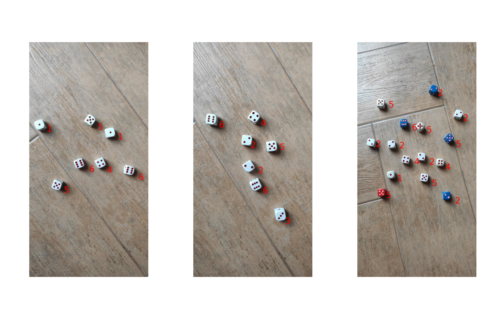
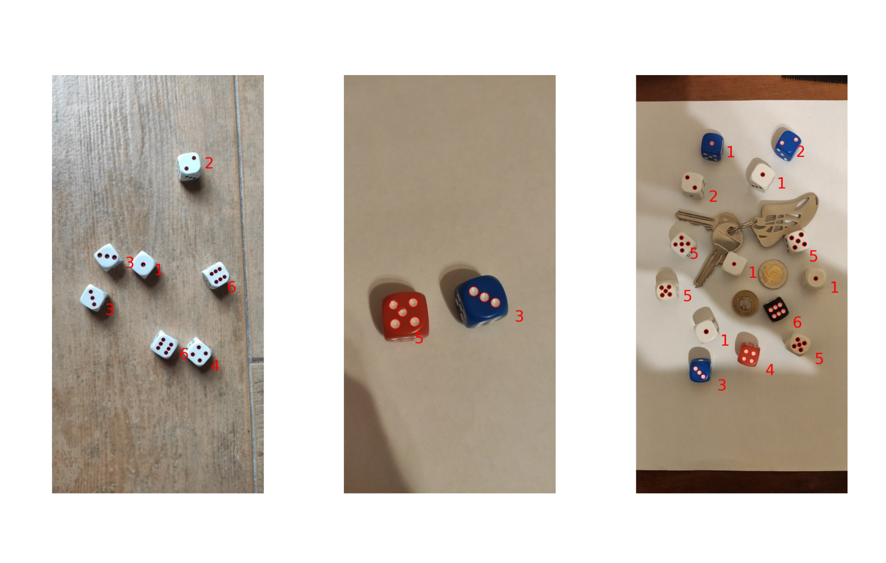
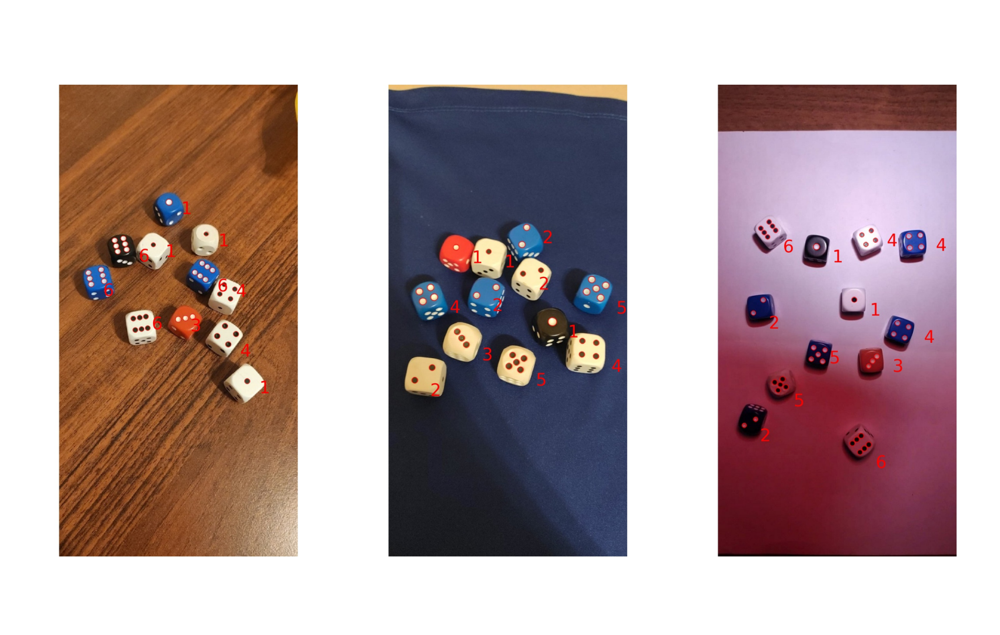
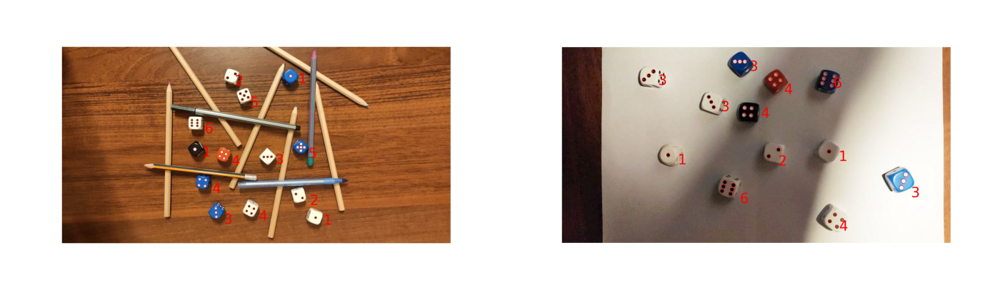

# DiceDetector
The purpose of the application is to detect dices in the given picture and count the values on their top face.

## Table of contents
* [General info](#general-info)
* [Technologies](#technologies)
* [Setup](#setup)
* [Input](#input)
* [Output](#output)

## General info
This project uses image processing. It was made in **November 2020**.
There are some sample .jpg files in the repository (resources/dices/dices_all) that can be used as example.

## Technologies
Python 3.7 and libraries

## Setup
Clone this repository using git bash:
```
https://github.com/bartosztkowalski/DiceDetector.git
```
Run using ***python*** or open in dedicated IDE (e.g. PyCharm)
```python
python DiceDetector.py
```

## Input
The program processes the .jpg file, which must be attached in the resources/dices/dices_all folder.
You can also modify line 136 of DiceDetector.py to set other subfolders of resorces/dices folder, for example:
```subfolders = ['dices_all/', 'dices_easy/', 'dices_medium/', 'dices_hard/', 'dices_extra_hard/']```

To run the program, attached pictures have to be in proper resolution. The preferable is something between 1280×720p and 1920x1080p

To process more than one picture comment out/delete line 141:
```#break # only the first picture```

## Output
There are some results of the program:



